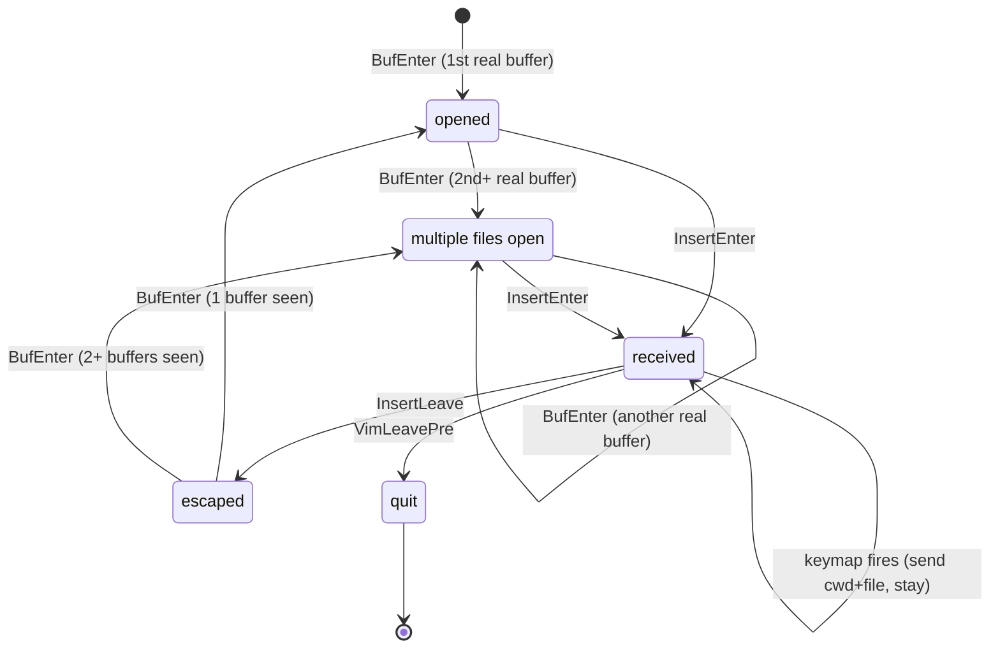

# Neovim plugin state machine

The Viking neovim plugin tracks the editor's lifecycle so the send keymap
(`<leader>vo` by default) only fires when the user is actively typing in a
real buffer. Insert-mode is the trigger window; everything else is bookkeeping.

| State                  | Entry trigger                                  |
|------------------------|------------------------------------------------|
| `opened`               | `BufEnter` on the first real buffer            |
| `multiple files open`  | `BufEnter` on a 2nd+ real buffer               |
| `received`             | `InsertEnter` from `opened` or `multi`         |
| `escaped`              | `InsertLeave` from `received`                  |
| `quit`                 | `VimLeavePre` from `received`                  |

"Real buffer" = `vim.bo.buftype == ''` (skips quickfix, help, terminal, etc.).
The send keymap is registered in insert mode and only acts when state is
`received`; it stays in `received` after firing so the user can send again
without leaving insert mode.
